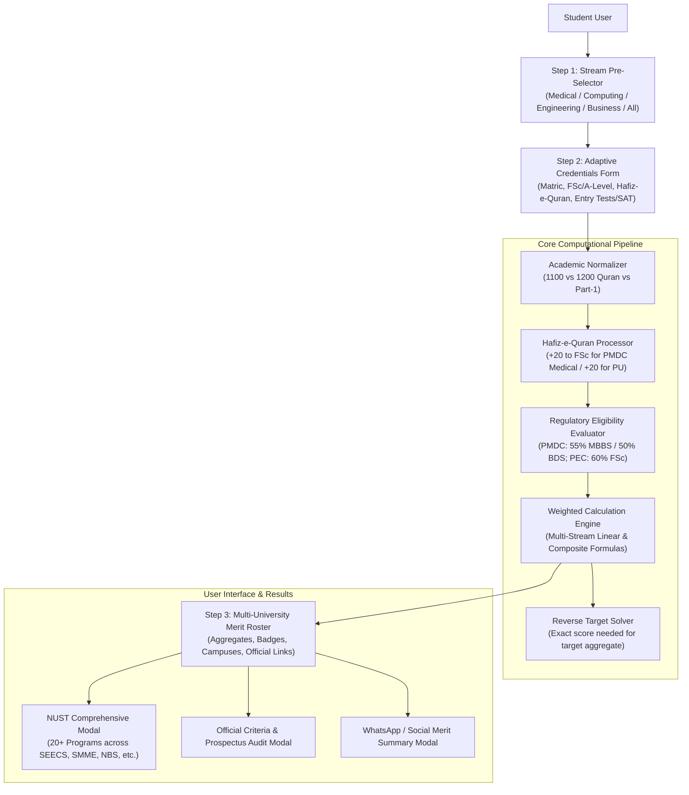

# 🏛️ Architecture & System Design — PakMerit (UniMerit-CalculatorPk)

## 1. System Overview

**PakMerit** is an open-source, client-side progressive web application (PWA) designed for Pakistani intermediate and A-Level students. It calculates admission merit aggregates simultaneously across all premier medical, computing, engineering, and business universities in Pakistan using official, verified criteria.



---

## 2. Multi-Discipline Stream & University Routing

Universities in Pakistan frequently offer programs across multiple streams (e.g. NUST offers Computing, Engineering, Business, and Sciences; GIKI offers Engineering and Computing; LUMS offers Computing, Engineering, and Business). 

### Category Mapping Architecture
Each institution defines its primary `disciplineCategory` and an array of `categories`:

```typescript
export interface UniversityConfig {
  id: string;
  name: string;
  shortName: string;
  disciplineCategory: 'medical' | 'computing' | 'engineering' | 'business' | 'sciences' | 'general';
  categories?: ('medical' | 'computing' | 'engineering' | 'business' | 'sciences' | 'general')[];
  disciplines: string[];
  campuses: string[];
  testName: string;
  testTotal: number;
  satSupported?: boolean;
  satTotal?: number;
  satMinScore?: number;
  satNotes?: string;
  formulaDisplay: string;
  sourceUrl: string;
  weights?: { matric: number; fsc: number; test: number };
  customFormula?: string;
  eligibilityMinAcademicPct: number;
  notes?: string;
}
```

When a student selects a stream (e.g. `computing`), the UI filter matches both `uni.categories.includes(selectedCategory)` and `uni.disciplineCategory === selectedCategory`. This guarantees:
1. **Zero Duplicate Cards:** An institution is represented with clean, consolidated campus listings without redundant entries.
2. **Universal Presence:** Multi-discipline institutions cleanly appear in every field they offer.

---

## 3. Official Regulatory Formulas & Weightages

### A. Medical & Dental Stream (PMDC Regulations)
Governed by the **Pakistan Medical & Dental Council (PMDC)**:
- **Standard Formula:** $50\% \text{ MDCAT} + 40\% \text{ FSc Pre-Medical} + 10\% \text{ Matric/SSC}$
- **Hafiz-e-Quran Policy:** 20 marks added to obtained FSc marks before percentage computation.
- **Passing Thresholds:**
  - MBBS: Minimum $55\%$ ($110/200$) in MDCAT.
  - BDS: Minimum $50\%$ ($100/200$) in MDCAT.
- **Participating Institutions:** UHS Punjab (KEMU, AIMC, Nishtar, etc.), NUMS (Army Medical College AMC & CMH), Dow / DUHS Sindh, KMU KPK, Aga Khan University (AKU), Shifa Tameer-e-Millat (STMU).

### B. Computing & Information Technology Stream
- **FAST-NUCES:** $50\% \text{ NU Test / SAT} + 40\% \text{ FSc} + 10\% \text{ Matric}$. Dedicated SAT cut-off: 1200/1600.
- **NUST (Computing):** $75\% \text{ NET / SAT} + 15\% \text{ FSc} + 10\% \text{ Matric}$.
- **LUMS SBASSE:** $50\% \text{ SAT/LCAT} + 40\% \text{ Intermediate} + 10\% \text{ Matric}$.
- **COMSATS:** $50\% \text{ NTS-NAT} + 40\% \text{ FSc} + 10\% \text{ Matric}$.
- **GIKI:** $85\% \text{ Test / SAT} + 15\% \text{ SSC (Matric)}$.
- **PUCIT (Punjab University):** Custom composite:
  $$\text{Academic \%} = \frac{0.25 \times \text{Matric} + \text{FSc} + \text{Hafiz Bonus}}{0.25 \times \text{Matric Total} + \text{FSc Total}} \times 100$$
  $$\text{Aggregate} = (\text{Academic \%} \times 0.75) + (\text{PU Test \%} \times 0.25)$$

### C. Engineering Stream (Pakistan Engineering Council - PEC)
- **PEC Requirement:** Mandatory minimum $60\%$ in FSc Pre-Engineering.
- **UET Lahore:** $33\% \text{ ECAT} + 50\% \text{ FSc} + 17\% \text{ Matric}$.
- **NED University Karachi:** $60\% \text{ NED Test} + 40\% \text{ Intermediate (HSC)}$ (Matric $0\%$).
- **PIEAS Islamabad:** $60\% \text{ Written Test} + 25\% \text{ FSc} + 15\% \text{ Matric}$.
- **SSUET Karachi:** $50\% \text{ SSUET Test} + 40\% \text{ Intermediate} + 10\% \text{ Matric}$.

### D. Business & Social Sciences Stream
- **IBA Karachi:** $100\% \text{ Aptitude Test}$ determination (HSSC $\ge 65\%$ eligibility for BBA, SAT $\ge 1270$ exemption).
- **NUST NBS:** $75\% \text{ NET Business} + 15\% \text{ FSc} + 10\% \text{ Matric}$.
- **FAST BBA:** $50\% \text{ Test/SAT} + 40\% \text{ FSc} + 10\% \text{ Matric}$.
- **FCCU Lahore & BNU Lahore:** Holistic evaluation indices with institutional tests and SAT acceptance.

---

## 4. Reverse Target Score Solver Engine

The reverse solver allows a candidate to input a desired aggregate percentage $A_{\text{target}}$ and derives the exact entry test or SAT score $S_{\text{req}}$ required:

$$\text{Contribution}_{\text{academic}} = (P_{\text{matric}} \times W_{\text{matric}}) + (P_{\text{fsc}} \times W_{\text{fsc}})$$
$$\text{Contribution}_{\text{test needed}} = A_{\text{target}} - \text{Contribution}_{\text{academic}}$$
$$S_{\text{req}} = \left\lceil \frac{\text{Contribution}_{\text{test needed}}}{W_{\text{test}} \times 100} \times S_{\text{total}} \right\rceil$$

### Edge Cases Handled:
1. $S_{\text{req}} \le 0$: Student academics already achieve the target aggregate (`already_achieved`).
2. $S_{\text{req}} > S_{\text{total}}$: Mathematically impossible target score (`impossible`).
3. $W_{\text{test}} \le 0$: University does not weight entry test scores.
4. Digital SAT minimum threshold override: If $S_{\text{req}} < S_{\text{min\_sat}}$, the solver adjusts to the mandatory minimum score required for eligibility.

---

## 5. Technology Stack & Verification Pipeline

- **Frontend Core:** React 19, TypeScript 5.8, Tailwind CSS v4, Lucide React
- **Build System:** Vite 6 with tree-shaking and offline Service Worker caching
- **Testing:** Vitest 3.2 suite with 50 automated test cases covering:
  - Regulatory weights sum verification
  - PMDC medical calculations and MDCAT thresholds
  - Reverse solver edge conditions and out-of-bounds rejection
  - IBCC equivalence conversion tables and Grade 'U' ineligibility
  - Strict negative value guards and academic percentage boundaries
  - Institutional HTTPS portal links

---

## 6. Edge Case Handling & Defensive Validation Architecture

The system enforces a multi-tiered defensive validation model ensuring zero silent corruption:

1. **Input Layer (`MarksInputForm.tsx`):**
   - Negative value detection (`marks < 0`): Highlights inputs in red with explicit feedback (`Obtained marks cannot be negative`).
   - Bounds checking (`obtained > total`): Displays clear error warnings.
   - Non-positive totals (`total <= 0`): Blocked with immediate validation flags.
   - SAT Score boundary (`400` to `1600`): Enforces College Board scale boundaries.

2. **Computational Engine Layer (`calculator.ts`):**
   - Rejects negative obtained marks or non-positive totals.
   - Returns `{ aggregate: 0, isEligible: false, missingPrerequisites: ['Invalid academic marks: Obtained marks cannot be negative'] }`.
   - Cards display `Your Aggregate: —` and `⚠️ Ineligible`.

3. **Reverse Solver Layer (`reverse.ts`):**
   - Targets $\le 0\%$ or $> 100\%$ return `status: 'impossible'` with explicit boundary error notices.
   - Negative academic inputs abort reverse calculation and declare candidate ineligible.

---

## 7. Cambridge IBCC Equivalence & Failed Subject Policy

Under **Inter Board Coordination Commission (IBCC) Equivalence Regulations (Clause 3.2)**:
- **O-Level / IGCSE (8 subjects):** Pakistani national candidates must pass 8 subjects (English, Urdu, Islamiyat, Pak Studies, Math + 3 electives). The minimum acceptable grade is **Grade E**.
- **A-Level (3 principal subjects):** Candidates must pass 3 principal subjects (e.g. Physics, Chemistry, Biology/Math).
- **Grade 'U' (Ungraded / Fail) Mandate:** If a student scores Grade 'U' in **ANY** single Cambridge subject, IBCC **refuses to issue an Equivalence Certificate**.
- **University Admission Mandate:** Higher Education Commission (HEC), PMDC, and PEC mandate that no candidate can be admitted to any university in Pakistan without an official IBCC Equivalence Certificate.
- **Implementation:**
  - `ibcc.ts` detects Grade 'U', sets `hasFailedSubject: true`, `isEligible: false`, and provides a detailed regulatory notice.
  - `IBCCConverterModal.tsx` provides a dual-tab interface for O-Level (8 subjects) and A-Level (3 principal subjects) with red ineligibility alert banners.
  - When applied, all university cards instantly transition to `⚠️ Ineligible (Failed IBCC Subject)` across all institutions.

---

## 8. Single National Curriculum: 1200 Marks (2026) vs 1100 Marks Scheme

### Why 1200 Marks is the 2026 National Default:
1. **The Punjab Compulsory Teaching of the Holy Quran Act (2021)** and **Federal Board (FBISE) Notification No. `FBISE/Curriculum/2022/411`** integrated 100 compulsory marks for *Tarjuma-tul-Quran-ul-Majeed* (50 marks in Part-1 / 11th grade and 50 marks in Part-2 / 12th grade).
2. Consequently, both SSC (Matric) and HSSC (Intermediate) in Punjab (BISE Lahore, Rawalpindi, Faisalabad, Multan, Gujranwala, Sahiwal, Bahawalpur, DG Khan, Sargodha) and Federal Board (FBISE) have a total of **1200 marks** (or 600 in 1st year).
3. The application sets total marks to **1200 marks** by default to reflect the modern 2026 academic structure.

### Why 1100 Marks Remains Supported:
1. **Sindh Boards (BIEK Karachi, Hyderabad, Sukkur, Larkana, Mirpurkhas):** Have not implemented the 100-mark Tarjuma-tul-Quran curriculum and remain out of **1100 marks**.
2. **IBCC Equivalence Certificates:** IBCC scales O-Level and A-Level equivalence to a fixed standard **1100 marks** denominator.
3. **Pre-2023 Repeaters / Gap-Year Candidates:** Students who passed intermediate prior to the 2022/2023 session have certificates based on the older 1100 marks framework.
4. The system includes an **Inter Stream Selector** (`FSc Pre-Engineering`, `Pre-Medical`, `ICS`, `FA Arts / General`) and allows manual total marks adjustments to ensure 100% precision for students from all provincial boards.

