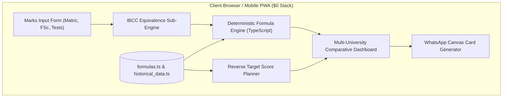

# 🎓 Pakistani Universities Merit Calculator & Predictor

> **Category:** EdTech / Admissions / High-Traffic Student Utility  
> **Target Audience:** 300,000+ Pakistani FSc, ICS, and O/A-Level students applying to top universities annually  
> **Budget:** Strictly **$0.00** (100% Client-Side Static App, zero backend, zero API costs)  
> **Quality Standard:** Anti-Slop (GPT-Taste + Impeccable + GASP) & Ponytail Minimalism

---

## 📖 Overview

Admission criteria across Pakistani universities are fragmented and confusing. Every university calculates its aggregate percentage differently:
- **NUST:** 75% NET + 15% FSc + 10% Matric
- **FAST NUCES:** 50% NU Test + 50% FSc (or 50% NAT + 50% FSc)
- **COMSATS:** 50% NTS-NAT + 40% FSc + 10% Matric
- **GIKI:** 85% GIKI Admission Test + 10% HSSC + 5% SSC
- **PUCIT (Punjab University):** 30% PU Test + 70% Academic Marks
- **UET (ECAT):** 33% ECAT + 50% FSc + 17% Matric
- **LUMS, FCCU, GCU, BNU:** Individual program-specific criteria

**Pakistani Universities Merit Calculator** solves this fragmentation with an ad-free, instant, mobile-first web application. Students enter their academic marks once and immediately see their aggregate across all universities simultaneously, alongside a reverse target score planner that calculates the exact entry test marks required to secure admission.

---

## 🌟 Key Features

1. **Simultaneous Multi-University Calculation:**
   - Single input form for Matric / SSC and FSc Part 1 or Part 2 marks.
   - Instantly computes aggregates across NUST, FAST, COMSATS, GIKI, PUCIT, UET, GCU, FCCU, and BNU side-by-side.
2. **Reverse Target Score Planner ("What score do I need?"):**
   - Select your target university and major (e.g. *FAST Islamabad Computer Science*).
   - Automatically references historical closing cutoffs and reverse-calculates:
     $$\text{Required Test Marks} = \frac{\text{Target Aggregate} - (\text{Academic Weight} \times \text{Academic } \%)}{\text{Test Weight}} \times \text{Total Test Marks}$$
   - Clearly flags whether the target is in the Safe Zone, Competitive Zone, or mathematically out of reach.
3. **Automated Cambridge IBCC Equivalence Converter:**
   - Built-in modal converting Cambridge O-Level and A-Level letter grades directly into official IBCC equivalent percentages without manual lookup charts.
4. **Historical Closing Merit Trends:**
   - Pre-curated benchmarks of past 3 years' closing cutoffs across top computing and engineering departments.
5. **Source Audit Modal:**
   - Transparent verification panel citing the exact official prospectus page or admission circular for every calculation formula.
6. **Native WhatsApp Share Card:**
   - Generates a clean, privacy-preserving visual badge using HTML5 Canvas for students to share directly with parents and peers on WhatsApp.
7. **Offline PWA Support:**
   - Progressive Web App with Service Worker caching (`public/sw.js`). Fully functional offline on mobile devices without data connections.

---

## 🏛️ System Architecture



- **Hosting:** GitHub Pages / Cloudflare Pages (**$0.00/month**).
- **Backend:** **Zero.** All logic runs client-side in the browser in `< 10ms`.
- **Runtime:** React 19 + TypeScript + Vite + Tailwind CSS.

---

## 🥊 Market Comparison: Why This App Wins

| Dimension | Legacy Competitors (IlmKiDunya, Eduvision, CampusGuru) | Pakistani Universities Merit Calculator |
|---|---|---|
| **User Flow** | Requires entering marks 10 times across 10 ad-filled separate pages. | **Enter once, calculate across all universities simultaneously.** |
| **Reverse Planning** | None. Only calculates forward aggregates. | **Tells you exactly what test score you need to cross last year's cutoff.** |
| **Cambridge O/A-Levels** | Clunky manual tables. | **Automated IBCC letter grade converter modal.** |
| **User Experience** | Heavy page load (5–8s), 40+ ad trackers, popups. | **< 0.5s load, 0 ads, 0 trackers, offline PWA.** |
| **Formula Credibility** | Often outdated (2019/2020 formulas). | **Source Audit Modal citing official current university prospectuses.** |

---

## ⚡ Lightweight & $0 Optimization Strategy

1. **Total Bundle Size:** `< 75KB` gzipped bundle.
2. **Offline-First:** All formulas and historical datasets reside in static TypeScript files. Once loaded, the app works on rural 3G or with zero internet access.
3. **No External Libraries for Visuals:** Uses lightweight SVG icons (`lucide-react`) and native HTML5 Canvas for WhatsApp share card generation.
4. **Zero Maintenance Bills:** Hosted entirely on free static infrastructure with zero API keys or databases.

---

## 🎨 Anti-Slop & Ponytail Minimalism

- **No AI Aesthetic:** No purple gradients, no oversized cards, and no meaningless buzzwords. Styled with a clean, functional slate/emerald theme with high-contrast tabular typography.
- **Ponytail Ladder:** Standard React local state — no Redux or Zustand boilerplate needed. Pure functions for all calculations. Native `<dialog>` modal behavior.

---

## 🚀 Quick Start

### Development
```bash
npm install
npm run dev
```
Open your browser at `http://localhost:5173`.

### Run Test Suite (Vitest)
```bash
npm test
```
All 20 unit and historical data tests pass in `< 600ms`.

### Build for Production
```bash
npm run build
```
Generates production assets in `dist/` ready for immediate deployment to GitHub Pages or Cloudflare Pages.

---

## 📁 Project Documents

- [RULES.md](file:///e:/Projects/Project%20Ideas/projects/03-merit-calculator/RULES.md) — Project-specific quality, citation, and student UX rules.
- [EXECUTION-PLAN.md](file:///e:/Projects/Project%20Ideas/projects/03-merit-calculator/EXECUTION-PLAN.md) — Phased development roadmap.
- [TEST-CASES.md](file:///e:/Projects/Project%20Ideas/projects/03-merit-calculator/TEST-CASES.md) — 48 test cases covering formulas, reverse planner, UI, and edge cases.
